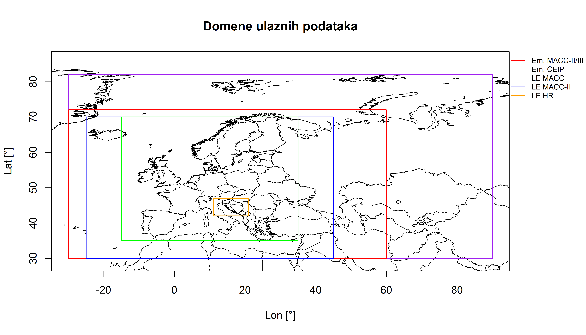
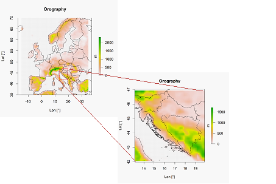
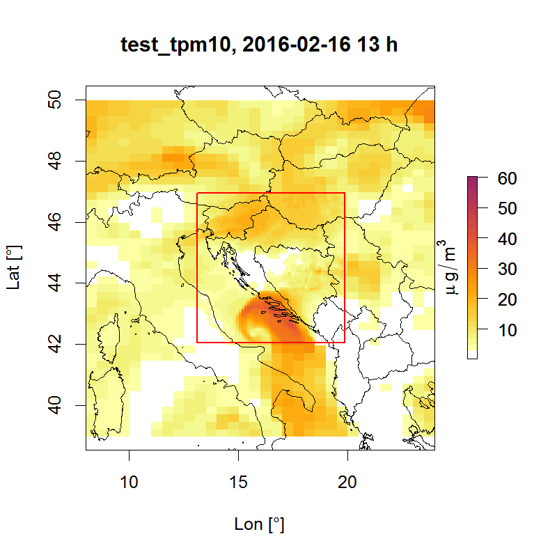

# LOTOS-EUROS-post-processing
Post processing za LOTOS-EUROS

## Uvod
Program za animaciju 2-D polja koncentracije polutanata i prikaz LE domene. 

## Domena
Domena je određena ulaznim podacima kao što su emisije, meteorologija itd. Osnovni run LE korsti MACC domenu.

*Tablica domene ulaznih podataka*
Ulazni podaci |	Naziv |	Lon [°] |	Lat [°] |	Rezolucija (lon x lat) [°]
--- | --- | --- | --- | ---
Emisije |	MAC-II (SNAP) |	-30,60 |	30,72 |	0.125 x 0.0625
Emisije |		MACC-III (SNAP) |	-30,60 |	30,72 |	0.125 x 0.0625
Emisije |		CEIP (GNFR) |	-30,90 |	30,82 |	0.1 x 0.1
Meteo |	ECMWF (meteo tools) |	-46.125,84.094 |	25.935,78.0866 |	F640, (360/4N,90/N) (0.140625 x 0.140625)
LE domena (rc file) |	MACC |	-15,35 |	35,70 |	0.5 x 0.25
LE domena (rc file) |		MACC-II |	-25,45 |	30,70 |	0.5 x 0.25
LE domena (rc file) |		HR |	13°,20° |	42°,47° |	0.125 x 0.0625

*Različite domene uaznih podataka*

## Definirati HR domenu

Domena treba biti dovoljno velika da uhvati velike (glavne) emisijske izvore oko Hrvatske (dolina Po, Srbije...) i ne prevelika da trajanje smiluacije bude prihvatljivo za prognostički/operativni run (30 min za simulaciju od 6 dana??). Trenutni prijedlog za domenu [13°,20°] x [42°,47°].

Omjer nestanja iz vece u manju domenu u WRF-a je obicno 1:3 zbog Arakawa C-staggered grida? U rubnim uvjetima nalaze se samo koncentracije polutanta, a ne i met. parametri, pa tome ne mora biti omjer 1:3 (LE model ne puca)?

##	CEIP/Ekonerg/aglomeracije emisije

Mogu li se emisije CEIP/Ekonerg/aglomeracije prilagoditi LE modelu. 
-	SNAP i GNFR razlike
-	Osim emisija potrebno su i podaci: aux,  base-nc,  composition,  height-distribution i   time-distribution   (razlike i mogu li se ti podaci koristiti za druge emisije)

##	Fire Emission 

Kao i meteo tools potrebno je posložiti „OpenLE-gfas“ tool za požare. Trenutno se u našem runu ne koriste globalne ni OpenLE-gfas emisije.

##	Napraviti tool za validaciju i vizualizaciju podataka

Potrebno je napraviti programe za validaciju i vizualizaciju podataka.

###	Animacija polja jedne ili više domena.
Program učitava jedan ili više izlaza modela različitih domena, radi slike i animacije.

